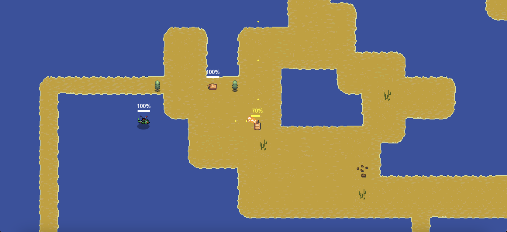

# JS 2d Game Engine

A JavaScript game engine built on the "Entity Component System" architecture, designed for rendering on a browser Canvas. Inspired by the C++ game engine featured in the related Pikuma course. Learn more at [pikuma.com](https://pikuma.com/).

The engine includes an ECS system, an event system and support for various game mechanics, like collisions and damage system.

# Chopper game

The engine comes with a basic 2d example game. The player can move a small helicopter and shoot projectiles to kill tanks, trucks and other types of enemies. Please beware that the game is incomplete and just for demonstration purposes.



# How to run

## Prerequisites

* Node.js installed

## Install dependencies

```
npm install
```

## Run

```
npm start
```

Now open the browser at http://localhost:1234
